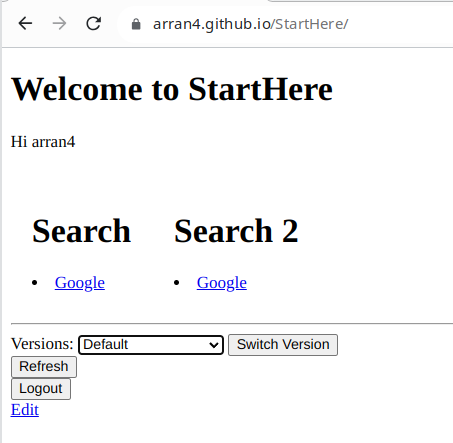
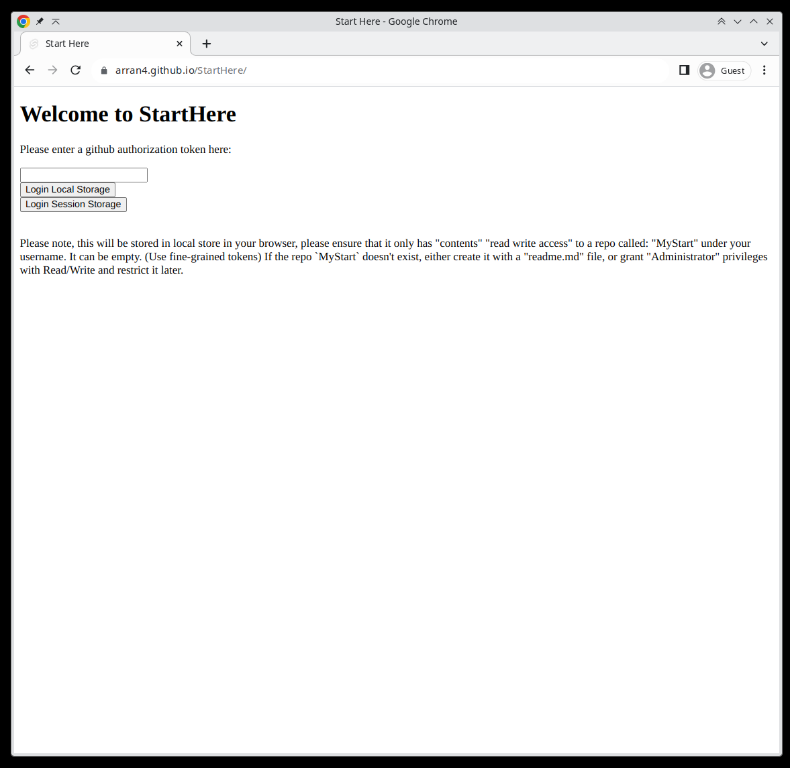
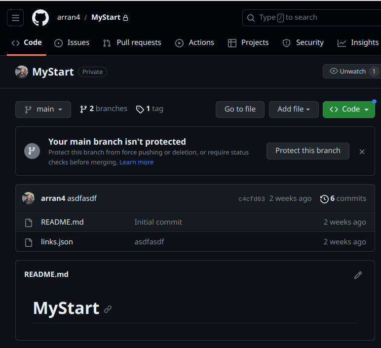
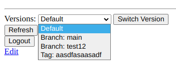
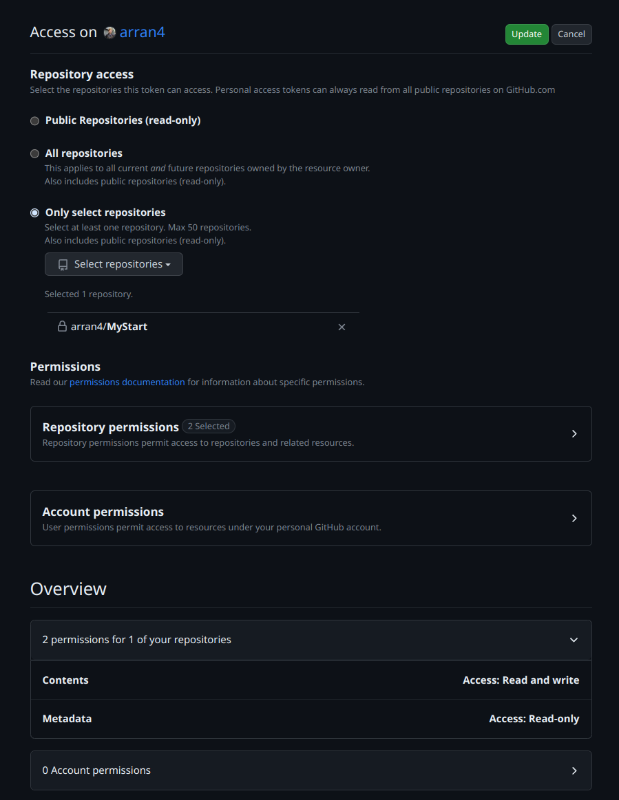

# StartHere

Obsoleted by Github lack of Oauth2 for SPA apps, thus prioritzing: https://github.com/arran4/gobookmarks/

This was an attempt to port my 199x-2007 project "Startpage" / "Bookmarks" to github pages. It wasn't successful as you need
to use a github token as github does not support SPA Oauth2 logins. You can still use it, however the requirement to use
tokens has made it rather insecure as you can't use it safely on public machines. (Although if you're comfortable with a 
public repo then it still might work for you.) I didn't port the markup language for this site over to typescript either.
I feel that, that was probably a mistake too as JSON is too verbose.

To checkout the site, start here: https://arran4.github.io/StartHere/ (See the getting setup guide below.)





The original purpose of this application is to be the first page you open your webbrowser to. I have a story behind it at
one of my blogs here: https://open.substack.com/pub/arranubels/p/quicklinks?r=1ner06&utm_campaign=post&utm_medium=web it's
an alternative to bookmarks really. However Google Reader + iGoogle eliminated the need for it and from that point the
way we use the web changed.

# Getting setup

To use this, I recommend that you:
1. Create a repo called: `MyStart` under your username in github
2. Create a github fine-grained token https://github.com/settings/personal-access-tokens which only has the following permissions:
    * Read / write access to `$YOURUSERNAME/MyStart`
    * Read access to metadata of  `$YOURUSERNAME/MyStart`
3. Create a file: `links.json` using the file format in the section below
4. Login to the site:  https://arran4.github.io/StartHere/ using the token

# Bookmarks file: `links.json`

In the repo `https://github.com/$YOURUSERNAME/MyStart` (which should be private but can be public) you should have a file
called `links.json`, it's contents should be based off:
```json

{
    "Columns": [
        {
            "Categories": [
                {
                    "Name": "Search",
                    "Links": [
                        {
                            "Name": "Google",
                            "Link": "https://www.google.com"
                        }
                    ]        
                }
            ]
        },
        {
            "Categories": [
                {
                    "Name": "Search 2",
                    "Links": [
                        {
                            "Name": "Google",
                            "Link": "https://www.google.com"
                        }
                    ]        
                }
            ]
        }
    ]
}
```



Which will look like this:


You can customize it with any details you want.

# Features

One of the key features of this version is that you can view branches and tags at the bottom of the page. The intention
was to have a look at the snapshots of the past but it could be used for pages, or sets or anything really.



# Github Token permissions screen cap

In case you don't know what the fine grain permissions should look like it should look like this:



